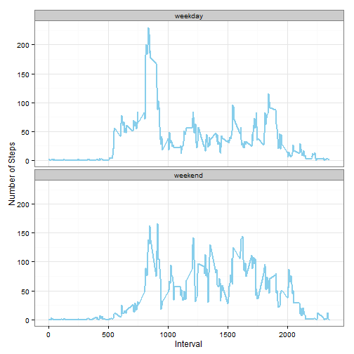

#Assumptions
- The Personal activity data file ("activity.zip") must be placed in the root directory
- You can get the zip file @ "https://d396qusza40orc.cloudfront.net/repdata%2Fdata%2Factivity.zip"

##0). Loading required libraries

```r
library(ggplot2)
library(xtable)
```


##1). Loading and preprocessing the data

```r
zipFile <- unzip("activity.zip")
activityDF <- read.csv(zipFile, colClasses = c("numeric", "Date", "numeric"))
```

##2). What is mean total number of steps taken per day?

####2.1). Calculating total number of steps taken per day and draw histogram

```r
activityDFByDate <- aggregate(steps ~ date, activityDF, sum, na.rm=TRUE)
hist(activityDFByDate$steps, col = "skyblue",  main = "#Steps Taken Each Day", xlab="Steps",  breaks = 20)
```

 

####2.2). Calculating mean and median of the total number of steps taken per day

```r
mean(activityDFByDate$steps)
```

```
## [1] 10766.19
```

```r
median(activityDFByDate$steps)
```

```
## [1] 10765
```

##3). What is the average daily activity pattern?

####3.1). Time series plot of the 5-minute interval (x-axis) and the average number of steps taken, averaged across all days (y-axis)

```r
activityDFByInterval <- aggregate(steps ~ interval, activityDF, mean, na.rm = TRUE)
ggplot(activityDFByInterval, aes(x=interval,y=steps)) + geom_line(color="skyblue",size=1) +  labs(x="Interval",y="Average Number of Steps") 
```

 

####3.2). Which 5-minute interval, on average across all the days in the dataset, contains the maximum number of steps?

```r
activityDFByInterval[which.max(activityDFByInterval$steps),]$interval
```

```
## [1] 835
```


##4). Imputing missing values

####4.1). Calculate and report the total number of missing values in the dataset (i.e. the total number of rows with NAs)

```r
sum(is.na(activityDF))
```

```
## [1] 2304
```

####4.2). Strategy for filling in all of the missing values in the dataset. 
**My strategy is to replace the missing values by the means of 5 minute interval**

####4.3). Create a new dataset that is equal to the original dataset but with the missing data filled in.

```r
activityDFByInterval <- aggregate(steps ~ interval, activityDF, mean, na.rm = TRUE)
activityDFImpute <- merge(activityDF, activityDFByInterval, by=c("interval"))
activityDFImpute <- transform(activityDFImpute, steps.x = ifelse(is.na(steps.x),steps.y,steps.x))
activityDFImpute <- data.frame(activityDFImpute[,1:4])
activityDFImpute$steps.x <- round(activityDFImpute$steps.x, digits = 0)
names(activityDFImpute) <- c("interval", "steps","date", "steps.y")
activityDFImpute <- activityDFImpute[,c("steps","date","interval")]
activityDFImpute <- activityDFImpute[order(activityDFImpute$date),]
```


####4.3.1). Make a histogram of the total number of steps taken each day. 

```r
activityDFImputeAgg <- aggregate(steps ~ date, activityDFImpute, sum, na.rm = TRUE)
hist(activityDFImputeAgg$steps, col = "skyblue",  main = "#Steps Taken Each Day of Imputes dataset", xlab="Steps",  breaks = 20)
```

 

####4.3.2). Mean total number of steps taken per day.

```r
mean(activityDFImputeAgg$steps)
```

```
## [1] 10765.64
```

####4.3.3). Median total number of steps taken per day.

```r
median(activityDFImputeAgg$steps)
```

```
## [1] 10762
```

####4.3.4). Do these values differ from the estimates from the first part of the assignment?
**The mean is differing slightly and the median is changed down to 3 steps** <br/>

<!-- html table generated in R 3.1.3 by xtable 1.7-4 package -->
<!-- Sun Jul 19 14:19:51 2015 -->
<table border=1>
<tr> <th>  </th> <th> Mean </th> <th> Median </th>  </tr>
  <tr> <td align="right"> activityDFByDate </td> <td align="right"> 10766.19 </td> <td align="right"> 10765.00 </td> </tr>
  <tr> <td align="right"> activityDFImputeAgg </td> <td align="right"> 10765.64 </td> <td align="right"> 10762.00 </td> </tr>
   </table>

####4.3.5). What is the impact of imputing missing data on the estimates of the total daily number of steps?
**The imputed estimate reduce the actual mean and median as per the expectation because adding missing value instances with average value will increase the frequency thereby decrease in mean an median. As we replace the NA with average steps, the values are differing slightly.**

##5). Are there differences in activity patterns between weekdays and weekends?
**Yes**

####5.1). Create a new factor variable in the dataset with two levels – “weekday” and “weekend” indicating whether a given date is a weekday or weekend day.


```r
activityDFImpute$day <- weekdays(activityDFImpute$date)
activityDFImpute$dayType <- ifelse(activityDFImpute$day %in% c("Saturday", "Sunday"),"weekend", "weekday")
activityDFImputeDayAgg <- aggregate(steps ~ interval + dayType, activityDFImpute, mean)
```

####5.2). Make a panel plot containing a time series plot

```r
ggplot(activityDFImputeDayAgg, aes(x=interval,y=steps)) +   geom_line(color="skyblue",size=1) +   facet_wrap(~dayType, nrow=2, ncol=1) +   labs(x="Interval",y="Number of Steps") + theme_bw()
```

 


